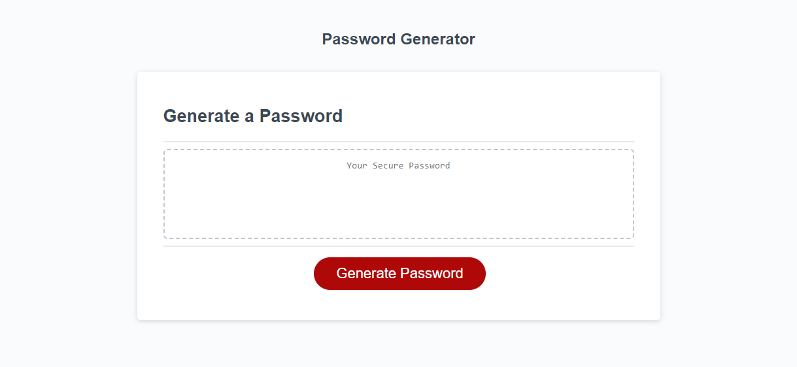

# Password Generator

## Description

The Password Generator will allow any user to create a randomized password using special characters, numbers, capitalized letter, and lowercase letters within the length of 8 to 129 characters.

### Items Completed
- Created a prompt window for the desired length to be inputted.
- Created confirm windows to select desired characters to be used.
- Used if statements to combine selected characters into one array.
- Used a for loop with math.random to select random characters from the one array.
- For loop then generates the randomized password with random elements from selected characters.

## Usage

Access the webpage here: [Password Generator](https://annie-mcelroy.github.io/password-generator/)

To create a randomized password please follow the steps below:
- Click "Generate Password" button on webpage.
- Answer the prompt message by putting in a number between 8 and 128.
- Select the type of characters you want to include: Special Characters, Numbers, Lowercase Letters, or Uppercase Letters. (You must select at least one!)
- The password will automatically generate within the box for you to select and copy!

## Credits

Starter code provided by University of Texas Coding Bootcamp.

## License

N/A

